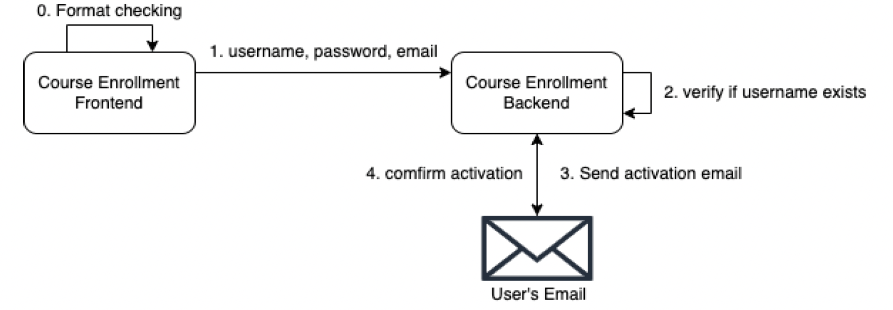

### [Distributed Trading System](https://github.com/Yuxuan-Li295/trade-release)

In this project, I engineered a scalable distributed trading system using **Spring Boot** and **Spring Cloud** within a microservice architecture, focusing on efficiency and reliability.

#### Challenges and Solutions:
1. **Search Performance and Accuracy**: Implemented goods search functionality using **ElasticSearch + Kibana**, enhancing performance and accuracy under massive data requests, including support for Chinese search with IK Segmenter.
2. **Unique ID Generation**: Utilized the SnowFlake algorithm for reliable ID generation in distributed environments.
3. **Message Queue Handling**: Integrated **RabbitMQ** to maintain data consistency through delayed messages and handle order generation asynchronously in concurrent scenarios.
4. **Inventory Management**: Improved inventory and data consistency by splitting inventory deduction into lockout, write-off, and rollback phases using **Redis + Lua** scripts.
5. **System Stress Testing**: Employed **JMeter** to simulate high volumes of concurrent requests, verifying system accuracy and robustness.
6. **Performance Optimization**: Used Redis for 'limit purchase' processing and cache warming to enhance page access performance.
7. **Static Content Management**: Implemented **Thymeleaf** template engine to generate static web pages, reducing backend load and improving response times.
8. **Security Enhancements**: Implemented a blacklisting model with data stored in Redis to intercept malicious requests efficiently.
9. **Service Discovery and RPC**: Used **SpringCloud** with **Consul** for service registry and **OpenFeign** for RPC service invocation.
10. **Database Scaling**: Applied database sharding with **Shardingsphere-JDBC** to enhance data storage capacity and query performance.
11. **Fault Tolerance**: Integrated **Hystrix** for current limiting strategies among sub-projects, with overall configuration managed in AWS Cloud.

### [Course Enrollment System](https://github.com/Yuxuan-Li295/COURSE-ENROLLEMNT)

In this project, I Developed a responsive web-based course enrollment system that allows students to manage their academic courses effectively.

#### Key Features:
- **User Interface**: Built with **React.js** and **Material-UI** for a dynamic and accessible user experience.
- **Backend Services**: Utilized **Spring Boot** and **Gradle** for robust API services. I utilized JHipster as a robust toolset that integrates Spring Boot for the backend, it automates much of the boilerpolate code and configuration, allowing me focus on the real service logic. Another use of JHipster in our project ensures that our system is built on solide foundation of best practices for security, database management, and service registration.
- **Login Interface**:

  

- **User Email Registration**: 

  

- **Authentication**: Implemented JWT-based authentication to secure user sessions and data.

#### Books


  


#### Papers


  
{{y}}

  


